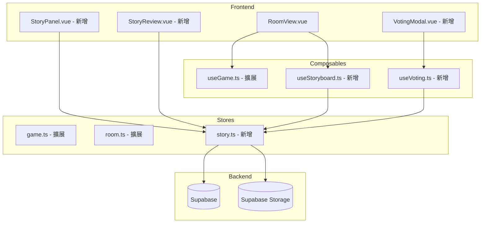
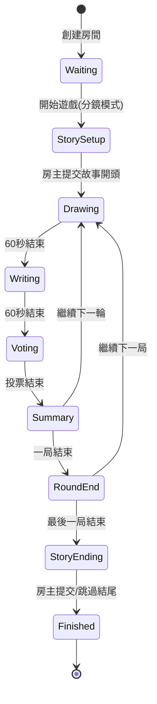

# Design Document: 分鏡接龍模式 (Storyboard Mode)

## Overview

分鏡接龍模式是「你畫我猜」遊戲的新玩法模式，將傳統的猜詞競技轉變為合作創作故事的體驗。核心設計原則是最大程度複用現有代碼，只修改判定邏輯和結算流程。

### 核心流程

每輪遊戲包含三個階段：
1. **繪畫階段（60秒）**：畫家根據上一輪勝出句子繪畫，編劇觀看
2. **編劇階段（60秒）**：編劇根據完成的畫作撰寫下一句故事
3. **投票階段（60秒）**：所有玩家投票選出最佳句子

### 與傳統模式的差異

| 功能 | 傳統模式 | 分鏡接龍模式 |
|------|----------|--------------|
| 題目來源 | 詞庫隨機選詞 | 上一輪勝出句子 |
| 猜測者行為 | 猜測標準答案 | 創作下一句故事 |
| 判定邏輯 | 精確匹配詞語 | 投票選出最佳 |
| 最終產出 | 分數排行榜 | 圖文故事鏈 |
| 最少人數 | 2 人 | 3 人 |

## Architecture

### 系統架構圖



### 狀態機



## Components and Interfaces

### 新增組件

#### 1. StoryPanel.vue
複用右側聊天面板位置，根據階段顯示不同內容：
- 繪畫階段：顯示故事歷史（只讀）
- 編劇階段：故事歷史 + 句子輸入框
- 投票階段：投票選項列表

```typescript
interface StoryPanelProps {
  phase: 'drawing' | 'writing' | 'voting' | 'summary'
  storyHistory: StoryChainItem[]
  submissions?: Submission[]
  mySubmission?: string
  votedSubmissionId?: string
}
```

#### 2. VotingModal.vue
投票階段的句子選擇界面

```typescript
interface VotingModalProps {
  submissions: Submission[]
  myUserId: string
  votedId?: string
  timeRemaining: number
}

interface VotingModalEmits {
  (e: 'vote', submissionId: string): void
}
```

#### 3. StoryReview.vue
遊戲結束後的故事回顧頁面

```typescript
interface StoryReviewProps {
  storyChain: StoryChainItem[]
  title: string
  participants: Participant[]
  scores: PlayerScore[]
}
```

#### 4. StorySetupModal.vue
遊戲開始時房主輸入故事開頭的彈窗

```typescript
interface StorySetupModalProps {
  isHost: boolean
}

interface StorySetupModalEmits {
  (e: 'submit', openingSentence: string): void
}
```

### 擴展現有組件

#### RoomView.vue 擴展
- 根據 `game_mode` 切換傳統模式和分鏡接龍模式的 UI
- 分鏡模式下用 StoryPanel 替換 GuessingPanel
- 添加階段狀態管理（drawing → writing → voting → summary）

#### WaitingLobby.vue 擴展
- 顯示當前遊戲模式標識
- 分鏡模式下檢查最少 3 人才能開始

### 新增 Composables

#### useStoryboard.ts
```typescript
export function useStoryboard() {
  // 故事鏈管理
  const storyChain: Ref<StoryChainItem[]>
  
  // 當前輪次提交
  const submissions: Ref<Submission[]>
  const mySubmission: Ref<string>
  
  // 方法
  function submitSentence(text: string): Promise<Result>
  function updateSubmission(text: string): Promise<Result>
  function getLatestSentence(): string
  function addToStoryChain(item: StoryChainItem): Promise<Result>
  function uploadCanvasSnapshot(canvas: HTMLCanvasElement): Promise<string>
  
  return { storyChain, submissions, mySubmission, ... }
}
```

#### useVoting.ts
```typescript
export function useVoting() {
  const votes: Ref<Vote[]>
  const myVote: Ref<string | null>
  const votingTimeRemaining: Ref<number>
  
  function castVote(submissionId: string): Promise<Result>
  function changeVote(submissionId: string): Promise<Result>
  function calculateWinner(): Submission
  function getVoteCounts(): Map<string, number>
  
  return { votes, myVote, votingTimeRemaining, ... }
}
```

## Data Models

### 數據庫表結構

#### game_rooms 表擴展
```sql
ALTER TABLE game_rooms ADD COLUMN game_mode VARCHAR(20) DEFAULT 'classic';
ALTER TABLE game_rooms ADD COLUMN single_round_mode BOOLEAN DEFAULT false;
ALTER TABLE game_rooms ADD COLUMN is_final_round BOOLEAN DEFAULT false;
```

#### story_chains 表（新增）
```sql
CREATE TABLE story_chains (
  id UUID PRIMARY KEY DEFAULT uuid_generate_v4(),
  room_id UUID REFERENCES game_rooms(id) ON DELETE CASCADE,
  round_number INTEGER NOT NULL,
  item_type VARCHAR(10) NOT NULL CHECK (item_type IN ('text', 'image')),
  content TEXT NOT NULL,
  author_id UUID REFERENCES auth.users(id),
  author_name VARCHAR(100),
  created_at TIMESTAMP WITH TIME ZONE DEFAULT NOW()
);

CREATE INDEX idx_story_chains_room ON story_chains(room_id, round_number);
```

#### story_submissions 表（新增）
```sql
CREATE TABLE story_submissions (
  id UUID PRIMARY KEY DEFAULT uuid_generate_v4(),
  round_id UUID REFERENCES game_rounds(id) ON DELETE CASCADE,
  user_id UUID REFERENCES auth.users(id),
  sentence TEXT NOT NULL,
  vote_count INTEGER DEFAULT 0,
  is_winner BOOLEAN DEFAULT false,
  created_at TIMESTAMP WITH TIME ZONE DEFAULT NOW(),
  updated_at TIMESTAMP WITH TIME ZONE DEFAULT NOW(),
  UNIQUE(round_id, user_id)
);

CREATE INDEX idx_story_submissions_round ON story_submissions(round_id);
```

#### story_votes 表（新增）
```sql
CREATE TABLE story_votes (
  id UUID PRIMARY KEY DEFAULT uuid_generate_v4(),
  round_id UUID REFERENCES game_rounds(id) ON DELETE CASCADE,
  voter_id UUID REFERENCES auth.users(id),
  submission_id UUID REFERENCES story_submissions(id) ON DELETE CASCADE,
  created_at TIMESTAMP WITH TIME ZONE DEFAULT NOW(),
  UNIQUE(round_id, voter_id)
);

CREATE INDEX idx_story_votes_round ON story_votes(round_id);
```

### TypeScript 接口

```typescript
// 故事鏈項目
interface StoryChainItem {
  id: string
  roomId: string
  roundNumber: number
  itemType: 'text' | 'image'
  content: string  // 文字內容或圖片 URL
  authorId: string
  authorName: string
  createdAt: string
}

// 句子提交
interface Submission {
  id: string
  roundId: string
  userId: string
  sentence: string
  voteCount: number
  isWinner: boolean
  createdAt: string
  updatedAt: string
}

// 投票記錄
interface Vote {
  id: string
  roundId: string
  voterId: string
  submissionId: string
  createdAt: string
}

// 輪次狀態擴展
type StoryboardRoundStatus = 
  | 'setup'      // 故事開頭設定
  | 'drawing'    // 繪畫階段
  | 'writing'    // 編劇階段
  | 'voting'     // 投票階段
  | 'summary'    // 結算階段
  | 'round_end'  // 一局結束
  | 'ending'     // 故事結局設定
```


## Correctness Properties

*A property is a characteristic or behavior that should hold true across all valid executions of a system-essentially, a formal statement about what the system should do. Properties serve as the bridge between human-readable specifications and machine-verifiable correctness guarantees.*

### Property 1: 遊戲模式設置一致性
*For any* 房間創建操作，當房主選擇分鏡接龍模式時，房間的 game_mode 字段應該被設置為 'storyboard'
**Validates: Requirements 1.2**

### Property 2: 最少人數限制
*For any* 分鏡接龍模式房間，當參與人數少於 3 人時，開始遊戲操作應該被拒絕
**Validates: Requirements 1.4**

### Property 3: 故事開頭存儲一致性
*For any* 有效的故事開頭句子（非空且不超過 100 字符），提交後應該成為 Story_Chain 的第一個元素
**Validates: Requirements 2.2**

### Property 4: 空白輸入驗證
*For any* 僅包含空白字符的字符串，作為故事開頭或句子提交時應該被拒絕
**Validates: Requirements 2.3, 4.7**

### Property 5: 字數限制驗證
*For any* 超過 100 個字符的字符串，作為故事開頭或句子提交時應該被拒絕
**Validates: Requirements 2.4, 4.8**

### Property 6: 繪畫階段提交限制
*For any* 處於繪畫階段的遊戲，編劇提交句子的操作應該被拒絕
**Validates: Requirements 3.3**

### Property 7: 句子提交存儲一致性
*For any* 有效的句子提交，應該被存入當前輪次的 Submissions 列表，且提交者 ID 正確
**Validates: Requirements 4.4**

### Property 8: 句子隱私保護
*For any* 編劇提交的句子，在投票階段開始前不應該被廣播給其他玩家
**Validates: Requirements 4.6**

### Property 9: 編劇階段修改允許
*For any* 處於編劇階段的遊戲，編劇應該能夠修改或重新提交句子
**Validates: Requirements 4.9**

### Property 10: 投票記錄一致性
*For any* 玩家的投票操作，應該正確記錄投票者 ID 和被投票的句子 ID
**Validates: Requirements 5.3**

### Property 11: 投票修改允許
*For any* 處於投票階段的遊戲，玩家應該能夠更改自己的投票
**Validates: Requirements 5.4**

### Property 12: 自投限制
*For any* 玩家嘗試投票給自己提交的句子，該投票操作應該被拒絕
**Validates: Requirements 5.5**

### Property 13: 投票結束條件
*For any* 投票階段，當所有玩家都已投票時，投票階段應該立即結束
**Validates: Requirements 5.6**

### Property 14: 畫家投票權限
*For any* 處於投票階段的畫家，應該能夠投票給任意編劇的句子
**Validates: Requirements 5.8**

### Property 15: 得票統計正確性
*For any* 投票結束後的統計，每個句子的得票數應該等於投給該句子的投票記錄數
**Validates: Requirements 6.1**

### Property 16: 勝出句子選擇正確性
*For any* 存在唯一最高票的情況，該句子應該被標記為勝出句子
**Validates: Requirements 6.2**

### Property 17: 平票隨機選擇
*For any* 存在多個最高票句子的情況，選出的勝出句子應該是這些最高票句子之一
**Validates: Requirements 6.3**

### Property 18: Story_Chain 更新一致性
*For any* 勝出句子確定後，Story_Chain 應該包含該句子和對應的畫布截圖 URL
**Validates: Requirements 6.5**

### Property 19: 編劇得分計算
*For any* 句子勝出的編劇，應該獲得 10 分
**Validates: Requirements 6.6, 9.2**

### Property 20: 畫家得分計算
*For any* 完成繪畫的畫家，應該獲得 5 + (投票人數 × 2) 分
**Validates: Requirements 6.7, 9.3**

### Property 21: 評星加分計算
*For any* 收到評星的畫家，應該獲得 平均星數 × 3 的額外分數
**Validates: Requirements 9.4**

### Property 22: 單局模式狀態轉換
*For any* 勾選單局模式的房間，一局結束後應該自動進入故事結局階段
**Validates: Requirements 7.2**

### Property 23: Final_Round 標記
*For any* 房主設定下一局為最後一局的操作，該局應該被標記為 Final_Round
**Validates: Requirements 7.4**

### Property 24: 結局倒數顯示正確性
*For any* Final_Round 進行中的輪次，顯示的「距離結局還有 N 輪」應該等於剩餘輪數
**Validates: Requirements 7.5**

### Property 25: 故事回顧作者標註
*For any* 故事回顧頁面中的分鏡，應該正確顯示畫作和句子的作者名稱
**Validates: Requirements 8.4**

### Property 26: 故事標題顯示
*For any* 故事回顧頁面，標題應該是房間名稱或故事開頭句子
**Validates: Requirements 8.7**

### Property 27: 貢獻統計正確性
*For any* 遊戲結束後的貢獻統計，句子勝出次數應該等於該玩家句子被選為勝出的次數
**Validates: Requirements 9.6**

## Error Handling

### 網絡錯誤
- 句子提交失敗：顯示錯誤提示，允許重試
- 投票提交失敗：顯示錯誤提示，允許重試
- 畫布截圖上傳失敗：使用佔位圖，記錄錯誤日誌

### 狀態同步錯誤
- 階段狀態不同步：以服務器廣播為準，強制同步
- 倒計時不同步：使用服務器時間戳計算剩餘時間

### 邊界情況
- 無人提交句子：使用「故事繼續發展中...」作為勝出句子
- 所有人棄權投票：隨機選擇一個提交的句子
- 玩家中途離開：該玩家的提交和投票保留，不影響遊戲進行

## Testing Strategy

### 單元測試
使用 Vitest 進行單元測試：
- 輸入驗證函數（空白檢測、字數限制）
- 得分計算函數
- 投票統計函數
- 勝出句子選擇邏輯

### 屬性測試
使用 fast-check 進行屬性測試：
- 每個屬性測試運行至少 100 次迭代
- 測試標註格式：`**Feature: storyboard-mode, Property {number}: {property_text}**`

### 測試重點
1. 狀態機轉換的正確性
2. 投票邏輯的公平性
3. 得分計算的準確性
4. Story_Chain 數據的完整性

